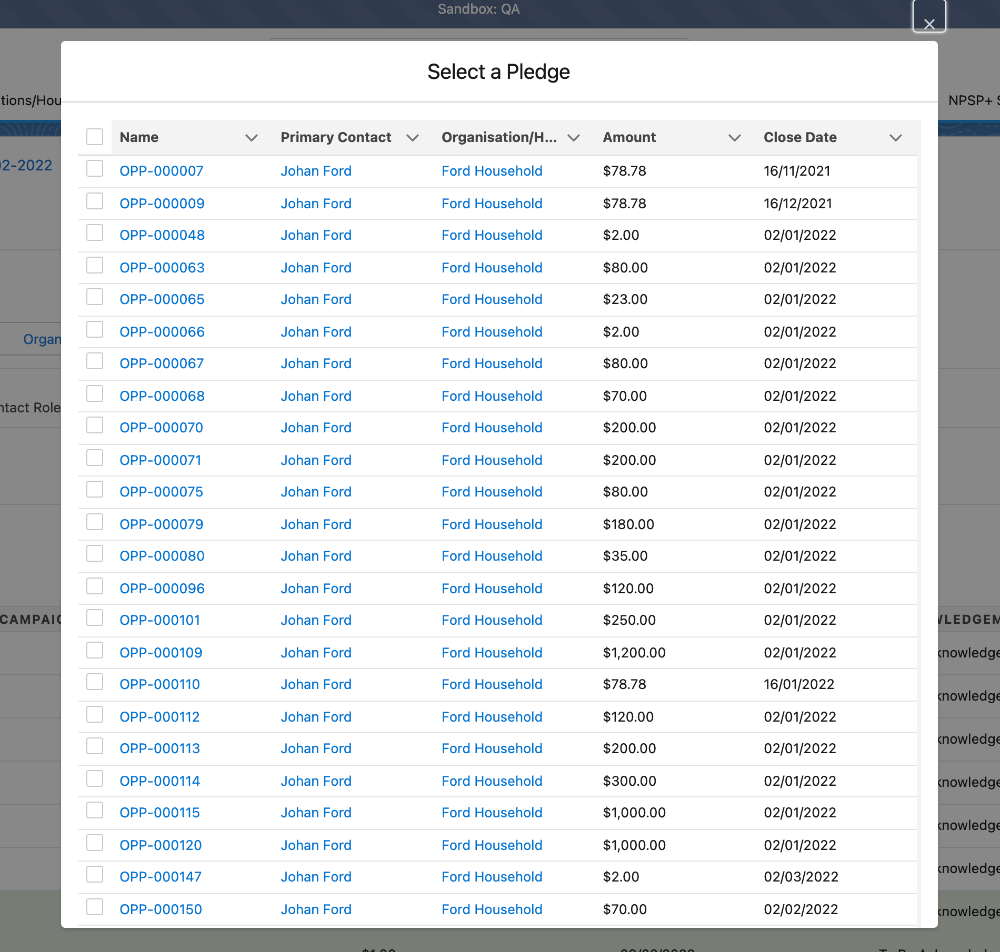

# Pledge Closer Functionality

.png>)


When a Contact / Organisation is selected, a User will have the ability to click on the Pledge Icon to detect if there are any Pledges for that particular contact.

If there are, a User will be able to select the Pledge that they are wishing to 'update' via the Pledge modal radio buttons:


